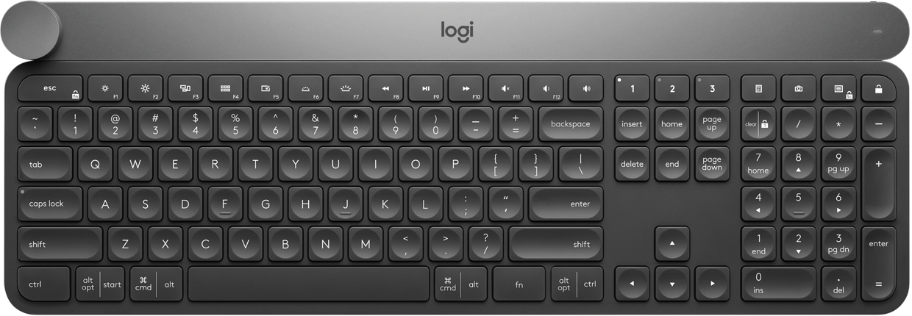
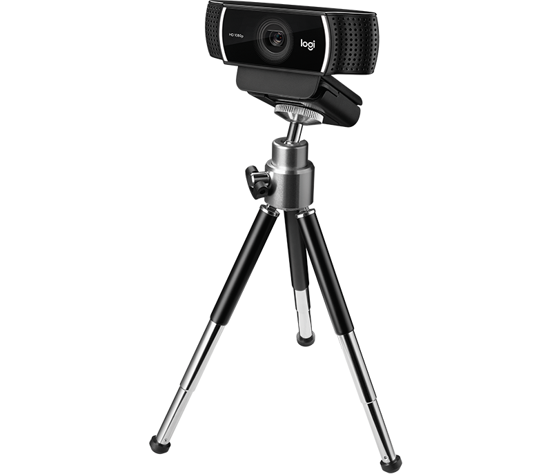
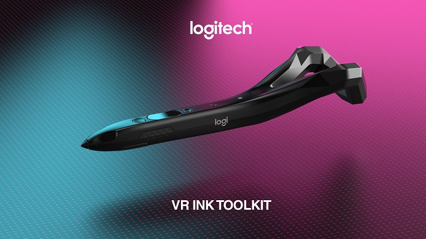

# Challenge #1 - Streaming & Broadcasting

_How can we enable producers & editors to create impactful content?_

## Food for thoughts

__Scenarios__

- Live streaming
- Record & post-processed broadcasts
- Single or multiple cameras
- Gaming, reviews, podcasts, performances, etc.
- Desktop vs mobile experiences

__Opportunities__

- Low latency publishing
- More impactful content
- Deeper viewer engagement

__Use Cases__

- Automate production
- Facilitate edition of short clips from footage
- Capture, edit & post from any surface
- Augment capabilities of edition tools
- Seamless camera interactions
- Context aware video filters
- Enhance video quality with smart lighting
- Enhance recorded content with smart filtering
- Infer popularity of produced content

# Challenge #2 - Open Challenge

_Create immersive experiences  with Logitech SDKs and hardware!_

## Food for thoughts

__Use Cases__

- Can __AR/VR__ enhance creativity, productivity, communication, education, - entertainment, etc.?
- Can MX gear and apps help make  a developer __most productive__? Same for a creative?
- Can CV make __HCI seamless__?
- Can AI help __find the eSports athletes__ with the highest potential?
- Can AI help __eSports athletes__ optimize their performance (cognitive, physical and - communication)?
- Can AI __drive immersion__ in remote collaboration scenarios?
- Can Jaybird help __coach athletes__ and optimize their training efficacy, e.g. get - the most of every run?
- Can connected __lights enhance__ the quality of a stream or cast?
- Can recorded __video be parsed__, labelled, cleaned and edited automatically?
- Can AI automatically __grade the quality__ and audience impact of a video clip?

# Resources

* [Craft SDK](https://github.com/Logitech/logi_craft_sdk/)

Create a custom plugin/profile that maps your app/software functions to our unique rotary controller called Crown. The plugin will give you the ability to map your app functions depending on the context of your user. For instance, when a user selects text, the font size is adjusted via the Crown.

    

* [Input Device Monitor SDK](./devmon/) : **hack into our devices!** Spy or capture device events for our flagship devices: **[MX Master 3](https://www.logitech.com/en-ch/product/mx-master-3)** and **[MX Keys](https://www.logitech.com/en-ch/product/mx-keys-wireless-keyboard)**.

*  Input event injections docs (Win [here](https://msdn.microsoft.com/fr-fr/library/windows/desktop/ms646304(v=vs.85).aspx) and [there](https://msdn.microsoft.com/en-us/library/windows/desktop/ms646310(v=vs.85).aspx), OSX [here](https://developer.apple.com/documentation/coregraphics/1456564-cgeventcreatekeyboardevent) and [there](https://developer.apple.com/documentation/coregraphics/1456527-cgeventpost), [Linux](https://www.kernel.org/doc/html/v4.12/input/uinput.html))

* Unleash the power of the **Logitech C922 webcam**! Start with [this](https://github.com/spmallick/learnopencv) comprehensive collection of OpenCV code samples

    

* Want a quick Computer Vision sample to get you started? [This](./cv) should be a good first step towards your human activity monitoring system (no cloud involved ;-)

* [Logitech VR Ink SDK](https://github.com/Logitech/vr_ink_sdk)

    

Create innovative immersive experiences with the brad new VR Ink, a Virtual Reality stylus.

The Logitech VR Ink [Toolkit](https://github.com/Logitech/vr_ink_sdk/tree/master/Assets/Toolkit) demonstrates some key interactions and capabilities of VR Ink, using a lightweight framework that allows you to build your own interactions as well. Accompanying code examples in Unity are included.

# Support

For support, you can either ping us on [our Slack channel](https://lauzhack2019.slack.com/archives/CQH0YMR0V) or just come to our booth!

    

